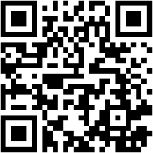
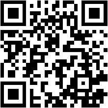

# Tour: 🟡🔴 Weekend Sila — Camigliatello due giorni (Cosenza)

Weekend di due giorni nella Sila con pernottamento a Camigliatello Silano. Combina pedalata, passeggiate nel bosco per famiglie, anelli ciclistici sui laghi e cena conviviale. Adatto a chi vuole vivere la montagna con ritmo rilassato ma anche a chi preferisce affrontare in autonomia la salita da Cosenza.

**Date proposte:** 12–13 agosto 2026

## Tracce Komoot

### Giorno 1 — Opzione unsupported: Cosenza → Camigliatello

| QR Code | Link e Descrizione |
|--------|------|
|  | **[Da Cosenza a Camigliatello Silano](https://www.komoot.com/it-it/tour/2945908206)** — Salita da Cosenza a Camigliatello Silano (35,8 km, +1.400 m). Percorso unsupported: senza supporto navetta, da affrontare in autonomia per arrivare al ritrovo delle 10:30. |

### Giorno 1 — Anello Cecita

| QR Code | Link e Descrizione |
|--------|------|
|  | **[Anello Camigliatello Lago di Cecita](https://www.komoot.com/it-it/tour/2465030104)** — Giro ad anello con visita al vigneto più "alto" d'Europa (41,6 km). Partenza consigliata ore 16:00, durata massima ~3 ore. Include il segmento verso la Chiesetta di San Lorenzo per l'osservazione delle stelle *(opzionale)*. |

### Giorno 2 — Anello Lorica via Montescuro

| QR Code | Link e Descrizione |
|--------|------|
|  | **[Giro ad anello Camigliatello Lorica passando da Montescuro](https://www.komoot.com/it-it/tour/2468775889)** — Anello via Lorica e Montescuro (87,4 km, +1.450 m). Partenza ore 08:30 da piazzetta Camigliatello. Pranzo a Lorica al [Chiosco Rosso](https://www.google.com/maps/search/?api=1&query=Il+Chiosco+Rosso,+Via+Nazionale+53,+87055+Lorica+CS). |
## Descrizione

Weekend organizzato di due giorni a Camigliatello Silano, nel Parco Nazionale della Sila. Il programma alterna tratti in bicicletta, momenti di socialità e attività pensate anche per le famiglie con bambini.

**Modalità di arrivo al Giorno 1:**

- **Opzione unsupported:** partenza da Cosenza in bicicletta seguendo la [traccia Cosenza → Camigliatello](https://www.komoot.com/it-it/tour/2945908206), senza supporto navetta. È necessario pianificare l'orario di partenza per raggiungere il punto di ritrovo entro le 10:30.
- **Opzione supportata:** arrivo a Camigliatello con auto, bus o altro mezzo concordato (con trasporto bici se necessario), per incontrare il gruppo alle 10:30.

**Sistemazione:** pernottamento alla [Stazione di Posta Norman Douglas](https://www.stazionediposta.it/) (Camigliatello Silano).

## Programma

### Giorno 1 — mercoledì 12 agosto 2026

| Orario             | Attività                                                                                                                                                |
| ------------------ | ------------------------------------------------------------------------------------------------------------------------------------------------------- |
| Mattina            | **Opzione unsupported:** pedalata Cosenza → Camigliatello (35,8 km, +1.400 m). Punto di partenza Piazza dei Bruzi, ore 5:30 del mattino.                |
| **10:30**          | Punto di ritrovo a Camigliatello Silano                                                                                                                 |
| —                  | Sistemazione in struttura (Stazione di Posta Norman Douglas)                                                                                            |
| **12:00**          | Pranzo                                                                                                                                                  |
| **13:00**          | Passeggiata nel bosco con i bimbi: Parco Camigliati → Rifugio del Tasso → pausa gelato → ritorno via Parco del Tasso → Stazione di Posta Norman Douglas |
| **16:00**          | [Anello Cecita](https://www.komoot.com/it-it/tour/2465030104) — visita al vigneto più "alto" d'Europa (durata massima ~3 ore)                           |
| **20:00**          | Cena                                                                                                                                                    |
| Sera *(opzionale)* | Osservazione delle stelle verso la Chiesetta di San Lorenzo *(segmento estratto dalla traccia dell'anello Cecita)*                                      |

### Giorno 2 — giovedì 13 agosto 2026

| Orario             | Attività                                                                                     |
| ------------------ | -------------------------------------------------------------------------------------------- |
| **07:30**          | Sveglia                                                                                      |
| **08:30**          | Punto di ritrovo in piazzetta Camigliatello                                                  |
| Mattina–pomeriggio | [Anello Camigliatello — Lorica via Montescuro](https://www.komoot.com/it-it/tour/2468775889) |
| *(a Lorica)*       | Pranzo al [Chiosco Rosso](https://www.google.com/maps/search/?api=1&query=Il+Chiosco+Rosso,+Via+Nazionale+53,+87055+Lorica+CS) |

## Dettagli percorsi

### Giorno 1 — Cosenza → Camigliatello *(opzione unsupported)*

**Distanza:** 35,8 km · **Dislivello:** +1.400 m / −350 m · **Riferimento Komoot:** ~2h46 di pedalata

**Partenza consigliata da Cosenza** (per arrivo entro le 10:30 a Camigliatello):

- **Gruppo Veloce (~20 km/h):** ~1h50-2h05 — partenza ~08:15-08:30
- **Gruppo Medio (~15 km/h):** ~2h25-2h45 — partenza ~07:30-07:45
- **Gruppo Lento (~10 km/h):** ~3h30-4h — partenza ~06:30-07:00

### Giorno 1 — Anello Cecita

**Distanza:** 41,6 km · **Dislivello:** +500 m / −500 m · **Riferimento Komoot:** ~2h28 di pedalata

**Partenza ore 16:00** (durata massima ~3 ore):

- **Gruppo Veloce (~20 km/h):** ~2h05-2h30 (pedalata + soste)
- **Gruppo Medio (~15 km/h):** ~2h45-3h00 (pedalata + soste)
- **Gruppo Lento (~10 km/h):** ~4h00-4h30 — valutare variante accorciata per rientrare entro l'orario

### Giorno 2 — Anello Lorica via Montescuro

**Distanza:** 87,4 km · **Dislivello:** +1.450 m / −1.450 m · **Riferimento Komoot:** ~4h53 di pedalata

**Partenza ore 08:30** da piazzetta Camigliatello. **Pranzo a Lorica** al [Chiosco Rosso](https://www.google.com/maps/search/?api=1&query=Il+Chiosco+Rosso,+Via+Nazionale+53,+87055+Lorica+CS) *(Via Nazionale 53)*, lungo il percorso dell'anello.

- **Gruppo Veloce (~20 km/h):** ~4h25-5h00 (pedalata + soste)
- **Gruppo Medio (~15 km/h):** ~5h50-6h30 (pedalata + soste)
- **Gruppo Lento (~10 km/h):** ~8h45-9h30 (pedalata + soste)

*Durata totale del tour: 2 giorni (con pernottamento)*

**Punti di interesse:**

- Camigliatello Silano
- Stazione di Posta Norman Douglas
- Parco Camigliati e Parco del Tasso
- Rifugio del Tasso
- Lago di Cecita e vigneto più "alto" d'Europa
- Chiesetta di San Lorenzo *(osservazione stelle, opzionale)*
- Lorica, Lago Arvo e [Chiosco Rosso](https://www.google.com/maps/search/?api=1&query=Il+Chiosco+Rosso,+Via+Nazionale+53,+87055+Lorica+CS) *(pranzo)*
- Montescuro
- Via delle vette
- Parco Nazionale della Sila

**Difficoltà:** 🟡🔴 Intermedio-Difficile *(complessivamente; la salita da Cosenza e l'anello del secondo giorno richiedono buona preparazione)*

**Audience:**

- 👨‍👩‍👧‍👦 Famiglie *(passeggiata nel bosco e programma pomeridiano)*
- 🚴 Ciclisti con buona preparazione per salite e distanze
- 🌲 Amanti della natura e della montagna
- 🏔️ Escursionisti ciclistici

**Periodo consigliato:** Maggio - Settembre (funivia operativa, temperature miti, passeggiate nel bosco percorribili)

Evitare i mesi invernali per condizioni meteo avverse in quota e per la chiusura stagionale di alcuni servizi.

**Meteo corrente a Camigliatello Silano:** [Consulta il meteo](https://www.ventusky.com/it/#p=39.32;16.45;12)  
**Meteo corrente a Lorica:** [Consulta il meteo](https://www.ventusky.com/it/#p=39.35;16.50;12)

## Pianificazione

**Date proposte:** 12–13 agosto 2026

**Proponi la tua disponibilità:** [Doodle - Weekend Sila Camigliatello](https://doodle.com/sign-up-sheet/organize) *(link da configurare)*

*Puoi indicare la tua disponibilità per le date proposte senza alcun impegno. La partecipazione verrà confermata in base alle disponibilità del gruppo.*

## Tour correlati

- [Ritorno a Cosenza da Camigliatello (Fago del Soldato e Montescuro)](camigliatello-cosenza-fago-del-soldato.md)
- [Camigliatello Lorica, giro del lago e funivia (Sila)](camigliatello-lorica-sila.md)

